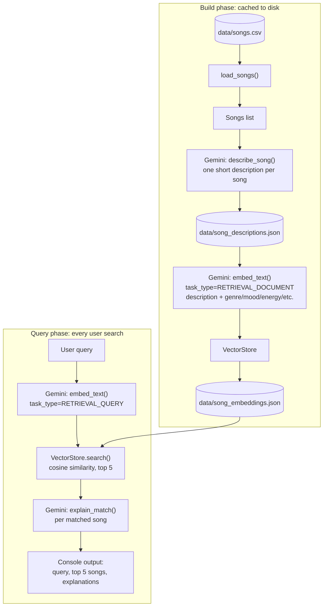

# Semantic Song Search Data Flow

Build phase (once, cached) → Query phase (every search).

```mermaid
flowchart TD
    subgraph BUILD["Build phase: cached to disk"]
        direction TB
        CSV[("data/songs.csv")]
        CSV --> LOAD["load_songs()"]
        LOAD --> SONGS["Songs list"]
        SONGS --> DESC["Gemini: describe_song()<br/>one short description per song"]
        DESC --> DESCCACHE[("data/song_descriptions.json")]
        DESCCACHE --> EMBED["Gemini: embed_text()<br/>task_type=RETRIEVAL_DOCUMENT<br/>description + genre/mood/energy/etc."]
        EMBED --> STORE["VectorStore"]
        STORE --> EMBEDCACHE[("data/song_embeddings.json")]
    end

    subgraph QUERY["Query phase: every user search"]
        direction TB
        Q["User query"]
        Q --> QEMBED["Gemini: embed_text()<br/>task_type=RETRIEVAL_QUERY"]
        QEMBED --> SEARCH["VectorStore.search()<br/>cosine similarity, top 5"]
        SEARCH --> EXPLAIN["Gemini: explain_match()<br/>per matched song"]
        EXPLAIN --> OUT["Console output:<br/>query, top 5 songs, explanations"]
    end

    EMBEDCACHE --> SEARCH
```
